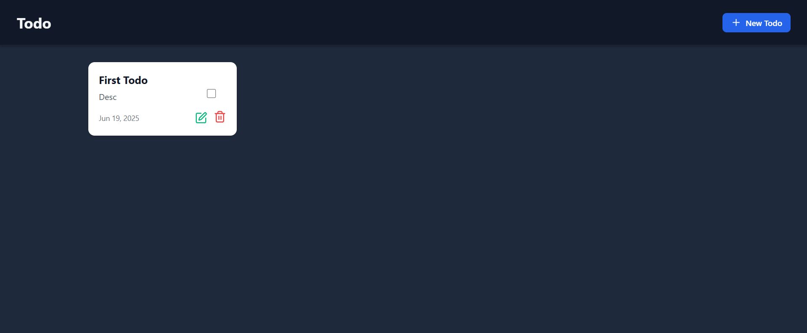
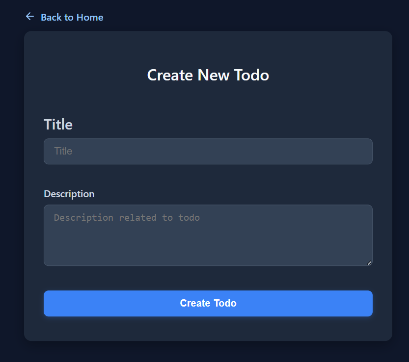
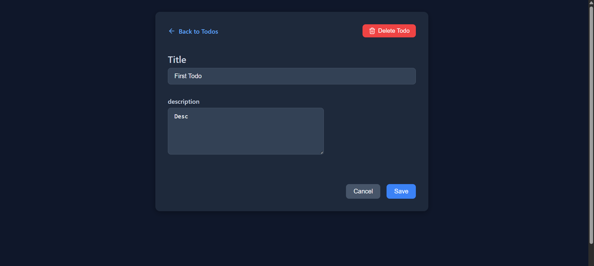

Simple Todo App using mern Stack

A simple, clean, and responsive full-stack Todo app built with **React** (frontend) and **Node.js + Express + MongoDB** (backend). Create, update, delete, and track todos with a sleek dark-mode UI.

---

## 🚀 Features

- ✅ Create, read, update, delete todos
- 🎨 Dark mode UI with animations
- 📌 Mark todos as completed
- ⚡ Instant UI updates (no reload)
- 📂 Responsive layout for all devices

---

## 🛠️ Tech Stack

### 🔹 Frontend:
- React
- React Router
- Axios
- Lucide Icons
- React Hot Toast

### 🔹 Backend:
- Node.js
- Express
- MongoDB + Mongoose
- dotenv

---


## 🌐 Live Demo

> _Coming Soon!_ (Will update once deployed to Vercel + Render)

---

## 🖥️ Screenshots






## 📦 Installation & Setup

### 🔧 Backend  

```bash
git clone https://github.com/your-username/todo-backend
cd todo-backend
npm install
npm run dev

### 🔧 Frontend

git clone https://github.com/your-username/todo-frontend
cd todo-frontend
npm install
npm run dev

✍️ Author
Made with ❤️ by Priyanshu Rai
Github : https://github.com/Priyanshu-010
LinkedIn : https://www.linkedin.com/in/priyanshu-rai-b41323264/

## 📜 License

This project is licensed under the MIT License - see the [LICENSE](LICENSE) file for details.
