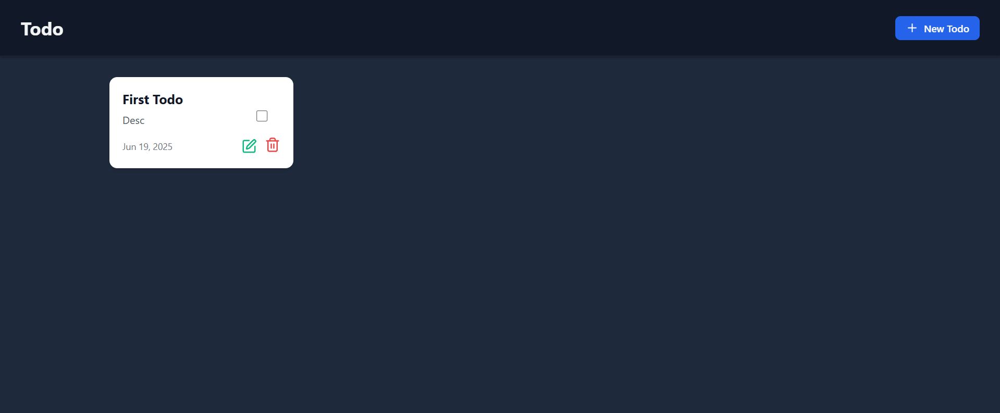
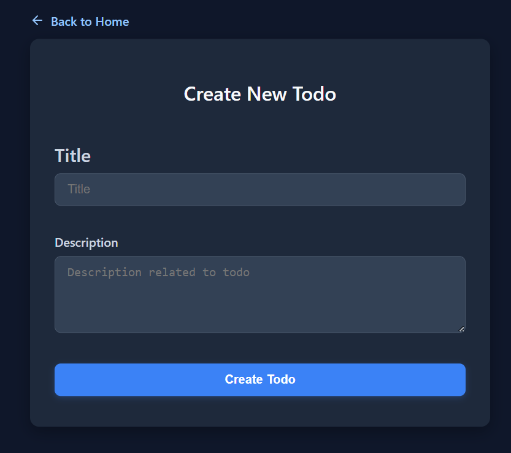
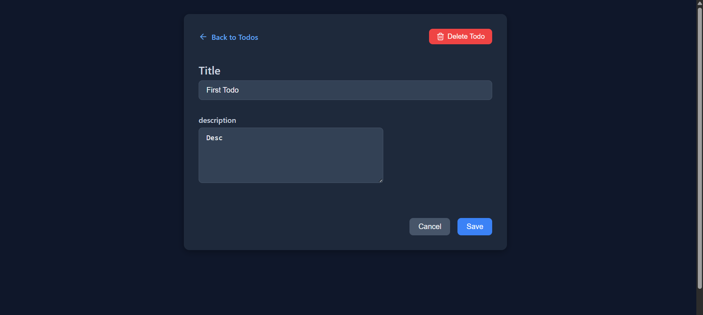
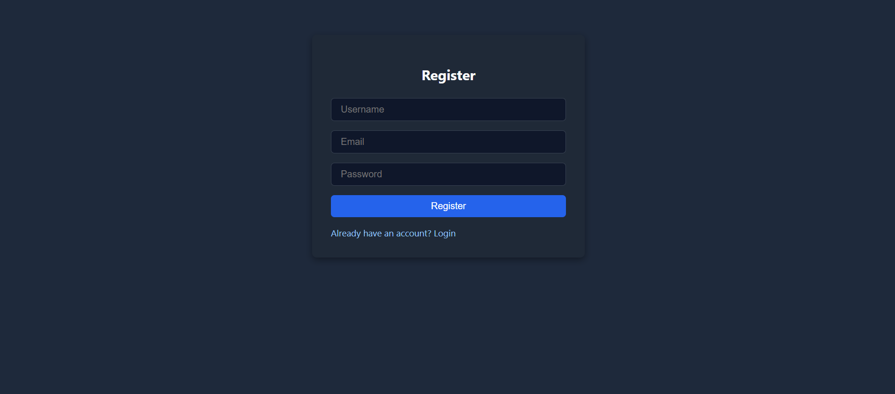
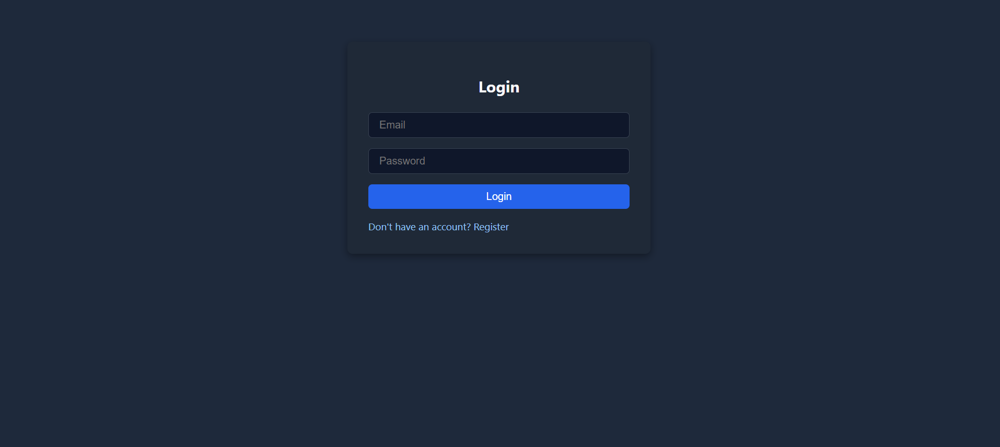

# ✅ Simple Todo App using MERN Stack

A clean, responsive, and full-stack **Todo Application** built with the **MERN Stack** (MongoDB, Express, React, Node.js). Users can register, log in, and manage their personal todos securely — all with a sleek dark-mode UI.

---

## 🚀 Features

- 🔐 **Authentication (JWT-based)**  
  Register, login, and secure access to personal todos
- ✅ **CRUD Operations**  
  Create, read, update, and delete todos
- 📌 **Mark as Completed**  
  Visual indication for completed tasks
- 🎨 **Dark Mode UI with Animations**
- ⚡ **Instant UI Updates** (No Reload)
- 💻 **Responsive Design**  
  Works across desktop, tablet, and mobile

---

## 🛠️ Tech Stack

### 🔹 Frontend:
- React (Vite)
- React Router
- Axios
- React Hot Toast
- Lucide Icons

### 🔹 Backend:
- Node.js
- Express.js
- MongoDB & Mongoose
- JWT (Authentication)
- dotenv

---

## 🔐 Authentication Flow

- User registration & login
- JWT stored in `localStorage`
- Auth context handles login/logout globally
- Protected backend routes with middleware
- Todos are user-specific

---

## 🌐 Live Demo

> _Coming Soon!_  
> *(Will be deployed using Vercel for frontend & Render for backend)*

---

## 🖥️ Screenshots







---

## 📦 Installation & Setup

```bash
git clone https://github.com/Priyanshu-010/Todo-Mern

### 🔧 Backend  

cd backend
npm install
npm run dev

# Create a .env file in the backend folder with:

PORT=3000
MONGODB_URI=your_mongodb_uri
JWT_SECRET=your_jwt_secret


### 🔧 Frontend

cd frontend
npm install
npm run dev

---

✍️ Author
Made with ❤️ by Priyanshu Rai

🌐 GitHub: https://github.com/Priyanshu-010

💼 LinkedIn: https://www.linkedin.com/in/priyanshuraidev


---

## 📜 License

This project is licensed under the MIT License - see the [LICENSE](LICENSE) file for details.
